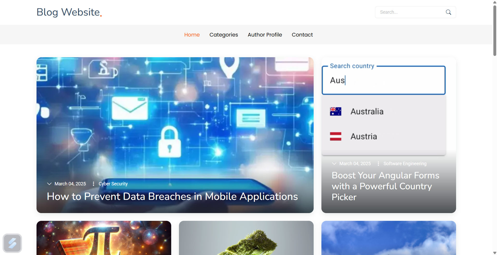
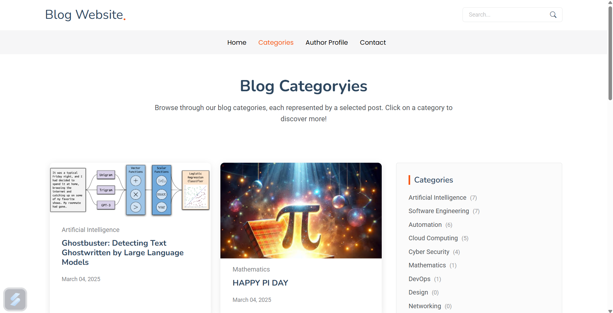
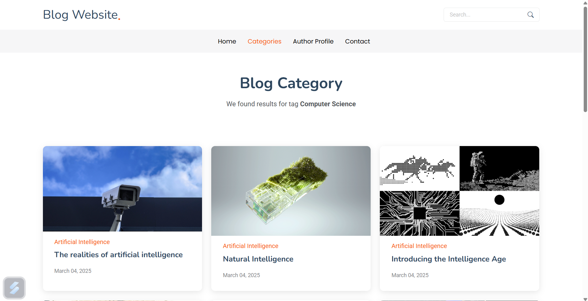
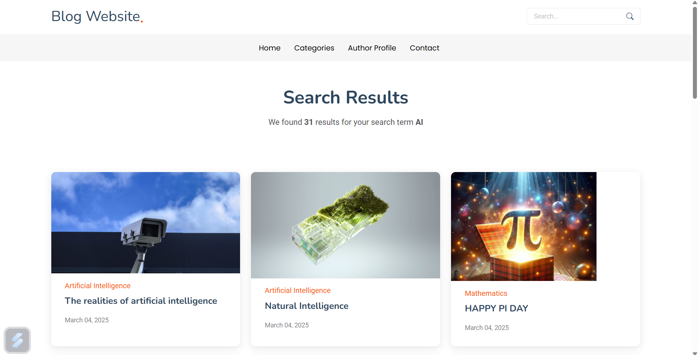
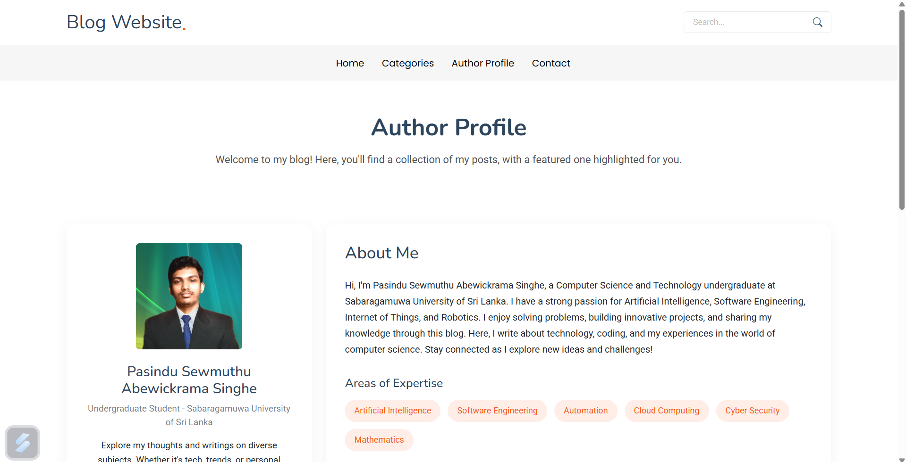

# 📝 Simple Blog - Django Web Framework

## 📌 Project Overview

This project is a **Simple Blog** web application built using the **Django Web Framework** as part of the **Computer Laboratory** subject in my **BSc. (Hons) in Computer Science and Technology** degree program at **Sabaragamuwa University of Sri Lanka**.

The blog platform provides a **user-friendly** and **secure** way to create, manage, and share blog posts. It incorporates user authentication, role-based permissions, and an interactive comment system to enhance engagement.

## ✨ Features

👉 **Blog Post Management**

- **Create, edit, and delete** blog posts with ease.
- **Rich-text editor** for writing engaging content.

👉 **Categorization & Tagging**

- Categorize blog posts for structured content.
- Use **tags** to improve searchability and organization.

👉 **Comment System**

- Readers can **comment** on blog posts.
- Authors can **respond** to comments, fostering a sense of community.

👉 **User-Friendly Interface**

- Intuitive UI for easy navigation and interaction.
- Responsive design for a seamless experience on all devices.

## 📸 Screenshots

### Home Page



### Blog Categories



### Single Category



### Search Results



### Blog Post Page


### Blog Post Comments


### Author Profile Page



## 🎥 Demo GIF

Check out the website in action:


## 🛠️ Tech Stack

| Component          | Technology                   |
| ------------------ | ---------------------------- |
| **Backend**        | Django (Python)              |
| **Frontend**       | HTML, CSS, Bootstrap         |
| **Database**       | SQLite (default)             |
| **Authentication** | Django Authentication System |

## 🚀 Installation & Setup

### **🔹 Prerequisites**

Ensure you have the following installed on your system:

- Python (≥ 3.8)
- pip (Python package manager)
- Virtual environment (optional but recommended)

### **🔹 Clone the Repository**

```sh
git clone https://github.com/PSewmuthu/Django_Blog_Website.git
cd Django_Blog_Website
```

### **🔹 Create & Activate Virtual Environment**

```sh
python -m venv venv  # Create virtual environment
source venv/bin/activate  # Activate on Mac/Linux
venv\Scripts\activate  # Activate on Windows
```

### **🔹 Install Dependencies**

```sh
pip install -r requirements.txt
```

### **🔹 Apply Migrations & Run the Server**

```sh
python manage.py migrate
python manage.py runserver
```

Now, open [http://127.0.0.1:8000/](http://127.0.0.1:8000/) in your browser to access the blog.
